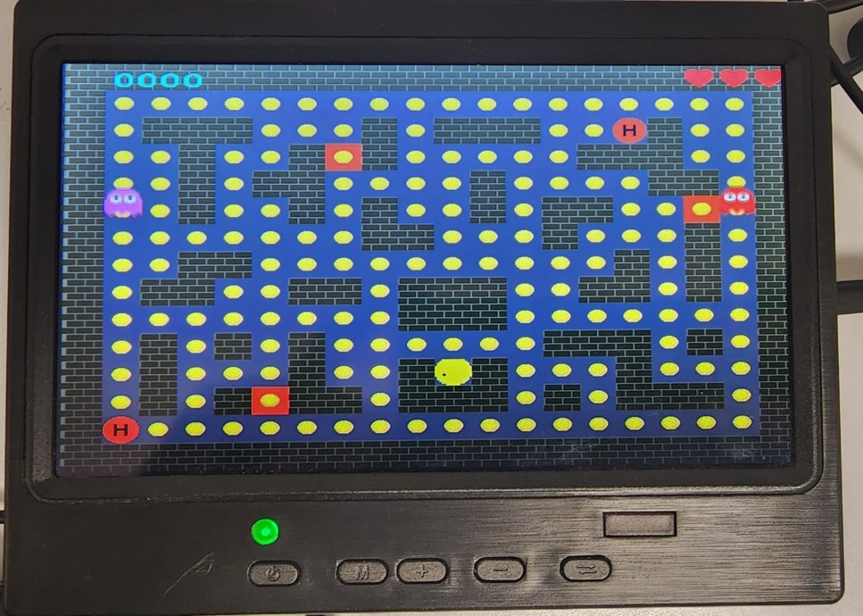
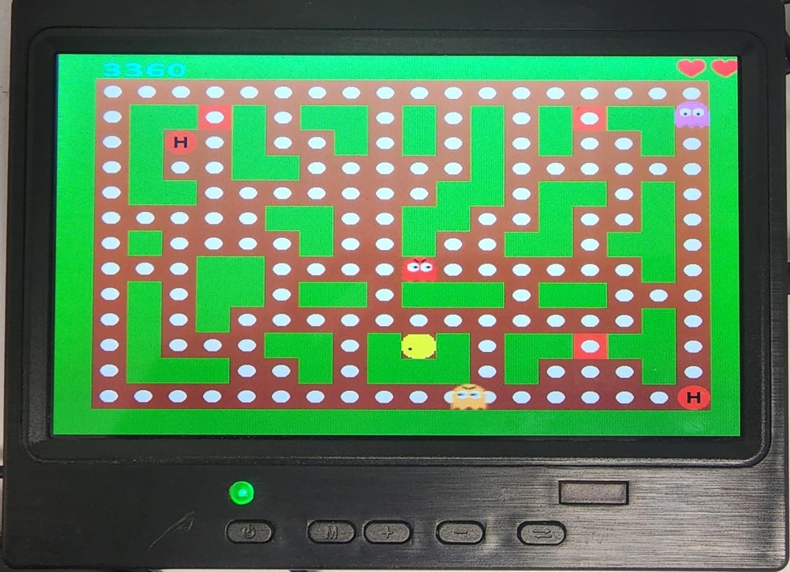

# Pac-Man on FPGA (SystemVerilog)

A hardware implementation of Pac-Man running on a DE10-Standard FPGA, rendered live to a VGA display and controlled from a keyboard. The game features a maze of destructible walls, collectible coins, lives and scoring, ghosts with chase-and-scatter AI, and a synthesized audio track — all described in **SystemVerilog** and synthesized to real hardware.

> **Project context & attribution.** This was the final project for *Electrical Engineering Lab 1A (044157)*, Andrew & Erna Viterbi Faculty of Electrical & Computer Engineering, Technion, built by **Saher Saadi and Abed Alwahhab Fakhoury**. The course provided a broad project theme and a minimal starting framework — a VGA controller, a keyboard interface, a 7-segment decoder, and a bare demo in which a "smiley" drifted in a random direction and bounced off the screen edges, plus an on-screen shape that only changed color on a key press. Within that theme, the specific game design — which mechanics, monsters, and features to build — was left to each team to decide; everything that makes this a *game* was designed and implemented by us on top of the base. Files that originated from the provided framework retain their original Technion copyright headers.

---

## Gameplay


   

The game runs live on the FPGA's VGA output. Level one is played on a blue maze; clearing its coins advances the player to a second level with a different green maze. Lives are shown as hearts in the top corner, the score and coin counters update in real time, and the three ghost types roam the maze.

---

## From the starting demo to a game

The provided demo did almost nothing: a sprite moved on its own and reversed at the borders. We rebuilt it into a full game by, among other things:

- turning the drifting sprite into a **keyboard-controlled Pac-Man** that moves in four directions and is blocked by walls,
- turning the inert color-changing shape into **collectible coins** and a **maze of walls**,
- adding **three kinds of ghosts** — one that wanders, one that chases, and one that does both,
- adding a **power-up** that briefly lets Pac-Man eat the ghosts (which flee while it's active),
- adding **two levels** with different maze layouts,
- adding **lives, scoring, and a countdown**, shown on screen and on the 7-segment displays,
- adding **destructible walls** (broken block-by-block in the direction of travel), **random maze generation**, and difficulty scaling,
- adding a **synthesized audio** layer for events and background music.

---

## How it works (design logic)

The whole system is **frame-synchronized**. The VGA controller emits a short `startOfFrame` pulse once per displayed frame (~30 Hz). All game state — positions, collisions, scoring, lives — updates exactly once per frame on that pulse, which keeps motion smooth and the logic deterministic regardless of pixel clock.

### Finite state machines

Game behavior is built from **state machines (מכונת מצבים)** rather than ad-hoc logic:

- **Player movement** is an FSM driven by the keyboard direction keys. It holds the current heading, advances Pac-Man one step per frame, and transitions out of a direction when a wall collision is detected ahead — so the player slides along corridors and stops at walls instead of clipping through them.
- **Ghost behavior** — each of the three monster types is driven by a state machine that selects its targeting rule (wander, chase, or both) and switches to a flee state when Pac-Man is empowered.
- **Game flow** (start → playing → life lost / level change) is sequenced as states gated by the per-frame pulse.

### Collision system

Each drawable object asserts a **drawing-request** signal while the raster scan is inside its bounding box. Two objects overlap exactly when their drawing requests are active at the same pixel, so collisions fall out of the rendering pass for free — Pac-Man vs. wall, vs. coin, vs. each ghost, and ghosts vs. walls are all detected this way.

The subtle part is that an overlap spans *many* pixels within one frame, but an event (eat a coin, lose a life) must register **once**. We solve this with a per-frame **single-hit pulse**: a semaphore flag latches the first overlap of a frame and suppresses the rest, emitting a single clean pulse that the scoring and lives logic can consume without double-counting. This per-frame-debounce idea is the backbone of the whole game's correctness.

### Ghosts: three behaviors

The game has **three monster types**, each its own block:

- **Scout** — wanders the maze randomly, choosing a new direction at junctions and when it hits a wall.
- **Chaser** — actively pursues Pac-Man, computing its next direction each frame from Pac-Man's relative position.
- **Scout-and-Chase** — a hybrid that alternates between wandering and pursuing.

Each monster's chase target is blended with a randomized component and scaled by the current level, so they get more aggressive as difficulty rises, and a `runMode` flips their behavior to *fleeing* when Pac-Man is empowered (below).

### Power-up: eating the monsters

A special **helper** pickup temporarily empowers Pac-Man. While it's active, **all three monsters** enter run/flee mode and Pac-Man can eat them on contact — eating a monster **adds to the score and resets that monster**, instead of costing the player a life. This inverts the normal collision outcome (monster contact usually costs a life), and the game logic switches which result a Pac-Man-vs-monster hit produces based on that state.

### Levels

The game has **two levels** with distinct maze layouts (the first on a blue field, the second on a green field). Clearing the coins on a level advances to the next; clearing the final level is the win condition.

### Losing & game over

Pac-Man starts with a fixed number of lives, shown as hearts on screen. Each time an **active (non-fleeing) monster** catches Pac-Man, the player loses a life. When lives reach **zero**, the game ends: a dedicated **game-over screen** is displayed, from which the player can **restart**. (When the player is empowered by the helper pickup, a monster contact has the opposite effect — see the power-up section above.)

### Maze & randomness

Walls are generated **pseudo-randomly** (seeded from timing/level/score) so layouts vary between runs, and destructible walls degrade through stages before breaking.

### Graphics & audio

Sprites are small bitmaps (≤ 32×32, per the course's compile-time budget) composited by an object multiplexer, over a full-screen background loaded from a `.mif` image. Audio is **purely synthetic** — sine-based tones assembled by a jukebox/melody player into event sounds and background music (no sampled audio).

---

## Features

- Four-direction, wall-aware keyboard control (arrow keys 2/4/6/8)
- Collectible coins with live scoring
- Lives and a time countdown (on-screen and 7-segment)
- Three ghost types: a wanderer, a chaser, and a hybrid
- A power-up that lets Pac-Man eat the ghosts: all three flee, and eating one scores points and resets it
- Destructible walls broken block-by-block in the direction of travel
- Pseudo-random maze generation and two levels with different layouts
- Lose a life when an active monster catches Pac-Man; at zero lives, a game-over screen lets the player restart
- Synthesized sound effects and music

---

## Tech stack

- **Language:** SystemVerilog (RTL)
- **Board:** Intel DE10-Standard (Cyclone V)
- **Toolchain:** Intel Quartus Prime (synthesis, place & route), ModelSim (simulation)
- **I/O:** VGA output, PS/2 keyboard input, on-board 7-segment and audio codec
- **Design techniques:** finite state machines, frame-synchronous datapath, modular sprite/collision architecture

---

## Repository structure

```
RTL/
├── VGA/          # game controller, player & ghost movement, collisions,
│                 #   sprite bitmaps, object mux, VGA controller
├── KEYBOARDX/    # keyboard decoder, randomness, random maze map
├── AUDIO/        # jukebox, melody/tone synthesis, audio codec interface
├── Seg7/         # 7-segment decoder
└── *.mif         # background image
constraints/      # pin & timing assignments
```

---

## Module guide

Some block names are inherited from the course base or are abbreviated, so they don't always describe what the block does. This maps the non-obvious ones to their actual role:

**Game flow & player**
- `game_controller` — central per-frame collision detector; emits one clean event pulse per collision type (see collision system above)
- `smiley_move` — Pac-Man movement state machine (direction, step-per-frame, wall blocking)
- `start_screen` — overall game-state sequencer: start / restart / game-over / level-transition / win screens (the name understates it — it drives global game state, not just a start screen)
- `level_adjust` — level progression and win condition (advances the level as coins are cleared)

**Ghosts**
- `MonsterScout*` — the wandering ghost (random direction at junctions/walls)
- `MonsterChasing*` (incl. `MonsterChasing_NextDir` / `NextDir2`) — the chasing ghost and its pathfinding: chooses the next direction toward Pac-Man, blended with randomness and scaled by level
- `MonsterScoutANDChase*` / `MonsterChaseandScout*` — the hybrid ghost that both wanders and chases
- `monster_mode_adjust` — per-ghost mode selector: switches between chase / random-scatter / run(flee) and outputs the chosen direction
- `Monster_move`, `Monster2_move`, `monster_2_move`, `monsterChasing_move` — per-ghost movement drivers

**Power-up, score & lives**
- `HelperMatrixBitMap` / `HELPER_DISPLAY` — the "helper" pickup that empowers Pac-Man to eat the ghosts; level-dependent
- `CoinsMatrixBitMap` / `COINS_DISPLAY` — the collectible coins and their counters
- `HartsMatrixBitMap` / `HART_DISPLAY` — the lives ("Hart" = heart) display
- `SoulsMatrixBitMap` / `SOULS_DISPLAY` — the souls/lives indicator
- `Score_addr_counter`, `Score_square_object` — score accumulation and its on-screen display

**Rendering**
- `VGA_Controller` — VGA timing and current-pixel coordinate generator
- `objects_mux` — pixel compositor: decides which object's color is shown at each pixel (layering/priority)
- `square_object` — generic rectangular bounding-box primitive ("is this pixel inside me?" + offset); the reusable base for positioned sprites such as walls and coins (it's a rectangle, not necessarily a square)
- `square_Hart_object`, `Score_square_object` — the same primitive specialized for the lives ("Hart" = heart) and score displays
- `back_ground_draw` — background image and maze borders; swaps to game-over / level / win backgrounds
- `*BitMap` modules — sprite pixel data (Pac-Man, monsters, numbers)
- `valX` — a Quartus-generated constant (LPM_CONSTANT megafunction), not custom logic

**Input & randomness**
- `keyPad_decoder` — decodes keyboard scan codes into directions/controls
- `random` — pseudo-random generator (latches a fast free-running counter on a key edge)
- `rnd_map` — random maze-layout generator (two seeds for two map variants)

**Audio**
- `JukeBox1` — selects melodies and sound effects (win / lose / coin / monster)
- `melody_player_1`, `ToneDecoder`, `SinTable`, `prescaler` — synthesize sine-wave notes from note codes
- `audio_codec_controller` (+ `i2c`, `clock_500`, `DualSerial2parallel`) — drives the on-board audio codec

---

## Credits

Built by **Saher Saadi** and **Abed Alwahhab Fakhoury** for Technion EE Lab 1A. The course set the overall theme and provided a minimal base — a VGA controller, keyboard interface, 7-segment decoder, and an initial movement demo (original Technion copyright headers retained on those files). The choice of mechanics and the full game design, logic, ghost AI, graphics composition, and audio were ours.
